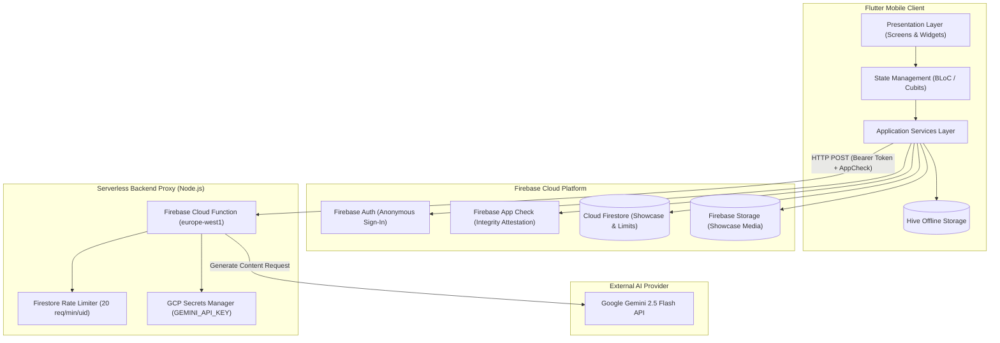
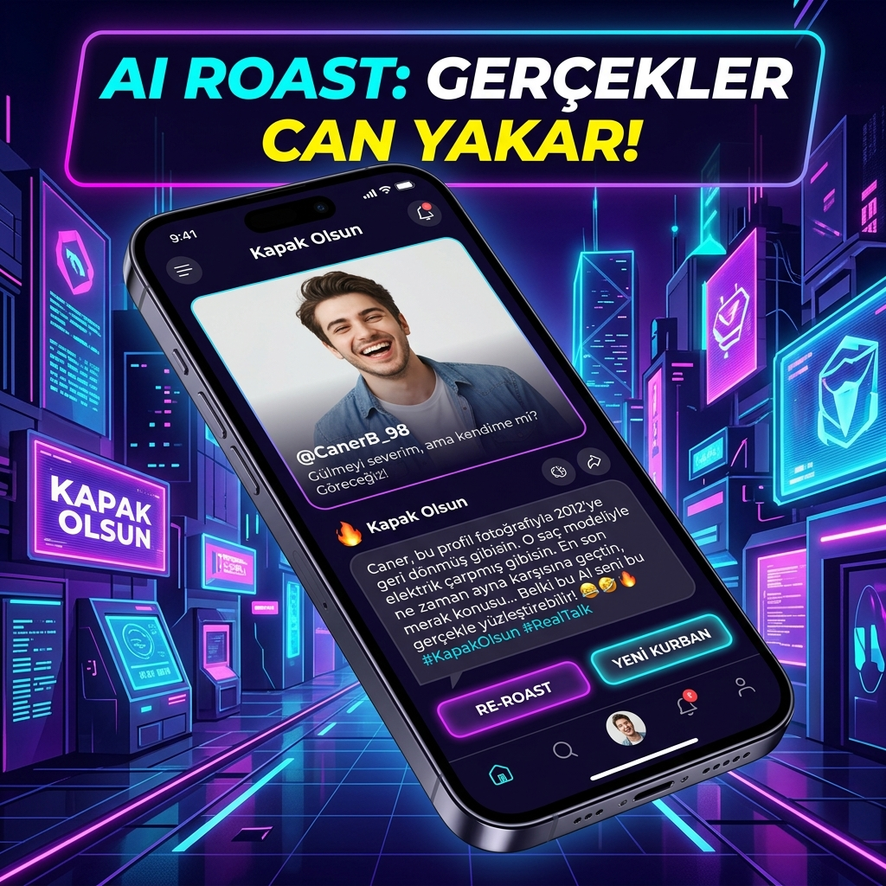
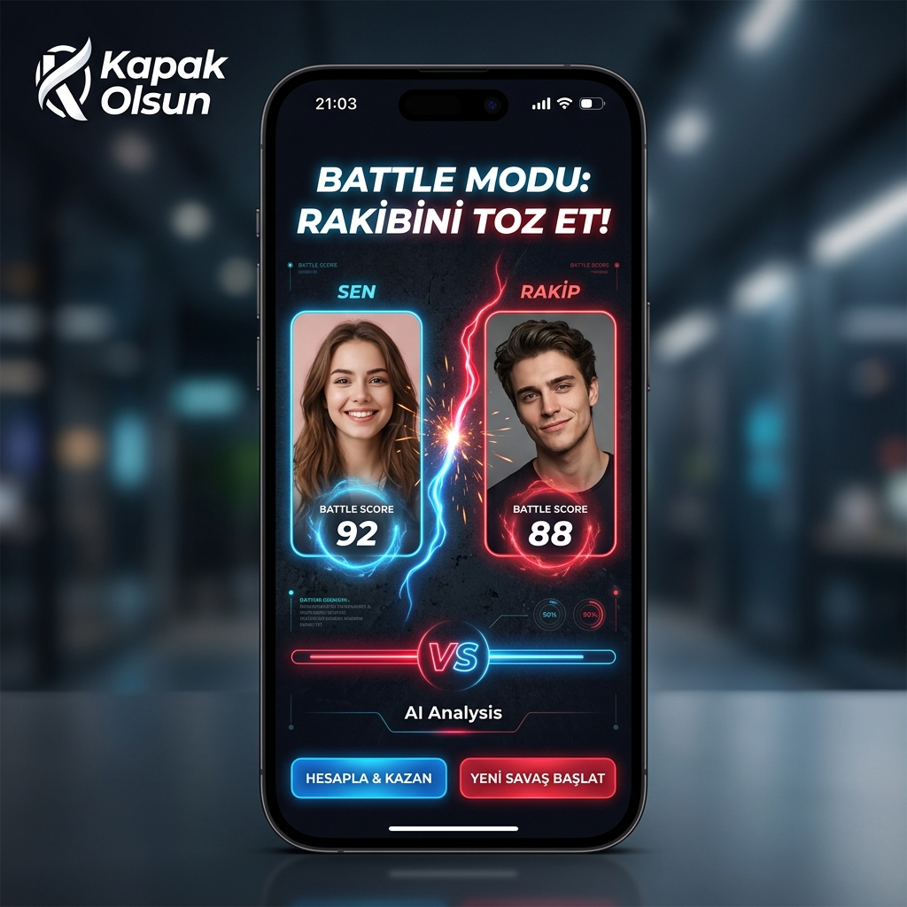

# Roastify 🔥

A production-grade, AI-powered mobile application built with **Flutter**, **Firebase Cloud Functions**, and **Google Gemini 2.5 Flash**. Roastify combines multi-modal image analysis, generative AI prompt engineering, and character-driven interactions to generate context-aware, witty visual commentary, praises, and head-to-head battle evaluations.

[](https://flutter.dev)
[](https://dart.dev)
[](https://firebase.google.com/)
[](https://ai.google.dev/)
[](https://bloclibrary.dev/)

---


---

## Table of Contents

- [Project Overview](#project-overview)
- [Key Features](#key-features)
- [User Flow](#user-flow)
- [System Architecture](#system-architecture)
- [AI Integration & Pipeline](#ai-integration--pipeline)
- [State Management](#state-management)
- [Technology Stack](#technology-stack)
- [Project Structure](#project-structure)
- [Security & Privacy](#security--privacy)
- [Installation & Setup](#installation--setup)
- [Configuration & Environment Variables](#configuration--environment-variables)
- [Screenshots & Visual Showcase](#screenshots--visual-showcase)
- [Testing](#testing)
- [Engineering Highlights](#engineering-highlights)
- [Future Improvements](#future-improvements)
- [Disclaimer](#disclaimer)
- [License](#license)
- [Author](#author)

---

## Project Overview

**Roastify** is designed as a full-stack mobile experience that demonstrates modern engineering practices in cross-platform mobile development, serverless backend security, and Generative AI integration.

Unlike basic wrapper applications that invoke LLM APIs directly from the client with hardcoded secrets, Roastify implements a **zero-trust, proxy-gated serverless architecture**. The client application captures and compresses image data, packages contextual metadata (mode, character persona, personal secrets), signs requests using **Firebase App Check** and **Firebase Authentication ID tokens**, and sends them to a secure **Node.js Cloud Function** deployed on GCP (`europe-west1`).

### Core Value Proposition

1. **Multi-Modal Vision Analysis**: Analyzes clothing, posture, expression, background elements, and overall aesthetic vibe using Google Gemini 2.5 Flash vision capability.
2. **Dynamic Character Personas**: Offers over 20 distinct AI personalities—ranging from pop-culture icons to custom user-defined personas—altering tone, jargon, and humor level.
3. **Head-to-Head Battle Mode**: Evaluates two photos simultaneously in a comparative duel, outputting structured ratings across **Style**, **Aura**, and **Vibe**, along with declaring a winner and providing comedic reasoning.
4. **Community Showcase ("Vitrin")**: A public feed backed by Cloud Firestore and Storage where users publish their favorite roasts and engage through real-time atomic reactions (💀 `RIP`, 💥 `BOOM`, 🔥 `FIRE`).

---

## Key Features

### AI-Powered Image Analysis
- Accepts input images from either the device Camera or Gallery.
- Implements an adaptive client-side image compression pipeline (`flutter_image_compress`), downsampling images through multi-pass resolution and quality degradation algorithms (768px down to 384px, JPEG quality 70% to 32%) to guarantee strict byte limits (< 90 KB for single roasts, < 65 KB per image for battles) before transmission.
- Sends optimized base64 image data payloads alongside engineered system prompts to Google Gemini.

### Character-Driven AI Responses
- **20+ Persona Directives**: Includes pre-configured character prompts such as *Fatih Terim*, *İlber Ortaylı*, *Müge Anlı*, *Hacer Teyze*, *Sarkastik Z Kuşağı*, *Gordon Ramsay*, *Behzat Ç.*, *Burhan Altıntop*, *Dr. House*, *Shakespeare*, and more.
- **Custom Persona Mode (`karakterOzel`)**: Allows users to input their own custom character name and behavioral directives.

### Roast Modes & Tone Customization
- **Acımasız (Savage)**: High-intensity, unfiltered satirical roast.
- **Biberli (Spicy)**: Balanced humor with sharp observations.
- **Tatlı Sert (Sweet & Gentle)**: Mild, friendly teasing.
- **Övgü & Motivasyon (Praise & Motivation)**: Inverts the engine to provide uplifting, humorous compliments and positive vibes.

### Personalization Engine
Users can attach optional contextual metadata to sharpen the AI's comedic focus:
- **Relationship Level (`kisiYakinligi`)**: Instructs the AI on how close the user is to the subject.
- **Annoying Habit (`sinirBozucuOzellik`)**: Feeds specific personal quirks into the prompt.
- **Inside Secret (`sir`)**: Injects undisclosed details for targeted inside jokes.

### Head-to-Head Battle Mode
- Allows users to upload two separate photos for a side-by-side battle.
- Generates a single, strict structured JSON response containing:
  - Individual roasts for both photos (`roast1`, `roast2`).
  - Winner decision (`winner`: `1` or `2`) and justification (`winner_reason`).
  - Comparative scores (`STİL`, `AURA`, `VİBE`) on a 1-10 numerical scale.
- Built-in resilient regex fallback parser (`_parseBattleResponse`) ensures robust handling even if LLMs wrap JSON in Markdown code blocks.

### Community Showcase & Atomic Reactions
- Published roasts are stored in Firestore under `/vitrin/{shareId}` and media files under Storage path `/vitrin_medya/{userId}/{shareId}/`.
- Real-time reaction counters (💀 `RIP`, 💥 `BOOM`, 🔥 `FIRE`) validated by Firestore Security Rules to enforce atomic single-increment transactions.

### Local Persistence & Offline History
- Powered by **Hive** (`hive_flutter`), allowing users to locally save, view, and manage their generated roasts and Savage Meter statistics offline.
- Daily usage limit tracking (`5` roasts/24-hour cycle) managed locally and validated server-side.

### Premium UI/UX Implementation
- **Glassmorphic Design System**: Custom `CamKart` and `CamKartV2` widgets using `BackdropFilter` with Gaussian blur and translucent gradients.
- **Dynamic Theming**: Full Light and Dark theme implementations managed by `AyarlarCubiti`.
- **Micro-Animations & Skeletons**: Integrated `shimmer` loading skeletons, `flutter_animate` entrance transitions, `lottie` animations, and `vibration` haptic feedback.

---

## User Flow

### Single Roast Flow

```text
┌───────────────────────┐
│     Pick Image        │
│   (Camera / Gallery)  │
└───────────┬───────────┘
            │
            ▼
┌───────────────────────┐
│   Select Personality  │
│  (20+ Personas / Custom)│
└───────────┬───────────┘
            │
            ▼
┌───────────────────────┐
│  Configure Mode &     │
│  Personal Secrets     │
└───────────┬───────────┘
            │
            ▼
┌───────────────────────┐
│ Client Compression &  │
│ Token Signing (App    │
│ Check + Auth Token)   │
└───────────┬───────────┘
            │
            ▼
┌───────────────────────┐
│ Cloud Function Proxy  │
│ (Rate Limit & Gemini) │
└───────────┬───────────┘
            │
            ▼
┌───────────────────────┐
│ Display Roast Result  │
│ (Share, Save to Hive, │
│  Publish to Showcase) │
└───────────────────────┘
```

### Battle Mode Flow

```text
┌─────────────────────────────────────────┐
│           Select Photo 1 & 2            │
└────────────────────┬────────────────────┘
                     │
                     ▼
┌─────────────────────────────────────────┐
│        Choose Battle Character          │
└────────────────────┬────────────────────┘
                     │
                     ▼
┌─────────────────────────────────────────┐
│ Dual Multi-Pass Compression (<65KB ea.) │
└────────────────────┬────────────────────┘
                     │
                     ▼
┌─────────────────────────────────────────┐
│  Serverless Proxy → Gemini Vision API   │
└────────────────────┬────────────────────┘
                     │
                     ▼
┌─────────────────────────────────────────┐
│   Parse Structured JSON (Scores & Win)  │
└────────────────────┬────────────────────┘
                     │
                     ▼
┌─────────────────────────────────────────┐
│  Render Battle Arena & Score Breakdown  │
└─────────────────────────────────────────┘
```

---

## System Architecture

The project follows a **Clean Architecture** pattern structured by features, strictly decoupling business logic from presentation, services, and external data sources.



### Architectural Component Breakdown

- **Presentation Layer**: Built with atomic Flutter widgets, customized themes (`UygulamaTemasi`), and reusable design system tokens (`AppSpacing`, `AppRadius`, `AppMotion`).
- **State Management**: Built with `flutter_bloc` (Cubit). Manages UI states, loading lifecycle phases (`analiz`, `tonAyari`, `metinUretimi`, `savasAnalizi`), and error propagation.
- **Service Layer**: Injected via `GetIt` (`servis_kayit.dart`). Includes `GeminiRoastServisi`, `GecmisServisi`, `IstatistikServisi`, `OlayIzlemeServisi`, `BaglantiServisi`, and `TitresimServisi`.
- **Serverless Cloud Function Proxy**: Located in `functions/index.js`. Acts as an API Gateway to prevent exposing sensitive Google Gemini API keys to the client binary.

---

## AI Integration & Pipeline

```text
[Mobile App] --(Image + Meta)--> [Compressor Engine] --(Signed Headers)--> [Firebase Cloud Function] --(API Key)--> [Gemini 2.5 Flash API]
```

### Step-by-Step AI Execution Lifecycle

1. **Client-Side Optimization**: The app compresses chosen images using JPEG format with recursive quality degradation (`70%` down to `32%`) and resolution stepping (`768px` to `384px`) until the target byte limit is achieved.
2. **Prompt Assembly**: The app constructs system instructions combining persona directives (`karakterPrompt`), intensity modifiers, and optional secret variables.
3. **Security Token Signing**:
   - `FirebaseAuth`: Obtains an ID token (`Authorization: Bearer <idToken>`).
   - `FirebaseAppCheck`: Obtains an App Check attestation token (`X-Firebase-AppCheck: <appCheckToken>`).
4. **Proxy Verification & Rate Limiting**:
   - Cloud Function verifies App Check token using `admin.appCheck().verifyToken()`.
   - Function decodes Firebase Auth ID token using `admin.auth().verifyIdToken()`.
   - Function checks user rate limits via Firestore transactions (`20 requests / 60 seconds / UID`).
   - Function validates payload size (`< 200 KB`).
5. **Gemini Invocation**: Cloud Function reads `GEMINI_API_KEY` from Google Cloud Secrets Manager and executes a `POST` request to `https://generativelanguage.googleapis.com/v1/models/gemini-2.5-flash:generateContent`.
6. **Response Parsing & Fallback Handling**:
   - Single roasts are parsed directly from candidate content parts.
   - Battle responses are processed by a multi-tier JSON extractor (`_parseBattleResponse`) capable of handling clean JSON, fenced markdown blocks (```json ... ```), and embedded bracket matching.

---

## State Management

State management is implemented using **Cubit** (`flutter_bloc`), isolating business logic from UI elements.

### Major Cubits & Responsibilities

| Cubit | State Class | Description |
| :--- | :--- | :--- |
| `RoastCubiti` | `RoastDurum` | Manages single image roast flow, image picking, compression, progress steps, and history saving. |
| `SavasCubiti` | `SavasDurum` | Manages dual image comparison, score matrix extraction, and winner evaluation state. |
| `VitrinCubiti` | `VitrinDurum` | Manages community feed loading, publishing roasts, and handling real-time reaction updates. |
| `AyarlarCubiti` | `AyarlarState` | Controls global app settings: Dark/Light theme mode, simulation mode toggle, and language choices (`tr`, `en`). |

### State Transition Lifecycle Example (`RoastCubiti`)

```text
RoastBaslangic
      ↓
RoastFotografSecildi(File image)
      ↓
RoastYukleniyor(RoastAsamasi.analiz)
      ↓
RoastYukleniyor(RoastAsamasi.metinUretimi, kismiMetin)
      ↓
RoastBasarili(RoastModel, File image)  OR  RoastHata(RoastHataTipi)
```

---

## Technology Stack

| Category | Technology | Version / Package | Purpose |
| :--- | :--- | :--- | :--- |
| **Mobile Core** | Flutter / Dart | SDK ^3.7.0 | Cross-platform UI & client application framework |
| **State Management** | Flutter BLoC | `flutter_bloc: ^8.1.6` | Predictable state management via Cubit |
| **Dependency Injection**| GetIt | `get_it: ^7.7.0` | Service locator & DI container |
| **Backend & Cloud** | Firebase Platform | `firebase_core: ^3.1.0` | Cloud backend infrastructure |
| **Authentication** | Firebase Auth | `firebase_auth: ^5.1.0` | Anonymous user authentication |
| **Attestation** | Firebase App Check | `firebase_app_check: ^0.3.2+10` | Device integrity attestation (Play Integrity / DeviceCheck) |
| **Cloud Storage** | Cloud Firestore | `cloud_firestore: ^5.0.1` | NoSQL database for community showcase & rate limits |
| **Media Storage** | Firebase Storage | `firebase_storage: ^12.0.1` | Public asset host for shared showcase images |
| **Serverless Proxy** | Firebase Cloud Functions v2 | Node.js (v18+) | Secure proxy gateway enforcing auth, limits, & key protection |
| **AI Engine** | Google Gemini API | `gemini-2.5-flash` | Multi-modal vision analysis & text generation |
| **Local Database** | Hive | `hive_flutter: ^1.1.0` | Fast key-value local database for offline roast history |
| **Image Compression** | Flutter Image Compress | `flutter_image_compress: ^2.4.0` | Multi-stage image downsampling engine |
| **UI & Animations** | Google Fonts / Lottie | `google_fonts`, `lottie`, `flutter_animate` | Typography, vector animations, & micro-interactions |
| **Crash Analytics** | Firebase Crashlytics | `firebase_crashlytics: ^4.3.2` | Production crash reporting & logging |
| **Testing** | Flutter Test / Integration | `flutter_test`, `integration_test` | Unit, widget, and end-to-end integration tests |

---

## Project Structure

```text
Roastify/
├── android/                        # Android native configurations & build scripts
├── assets/                         # Application assets
│   ├── ikon/                       # App icons & store graphics
│   └── maza_grafikleri/            # High-res store showcase screenshots
├── dart_defines.env.example        # Environment variables configuration template
├── firebase.json                   # Firebase CLI configuration
├── firestore.rules                 # Cloud Firestore security rules
├── functions/                      # Firebase Cloud Functions (Node.js backend proxy)
│   ├── index.js                    # Cloud Function implementation & Gemini proxy
│   ├── index.test.js               # Cloud Functions unit tests
│   ├── package.json                # Node.js backend dependencies
│   └── rules.test.js               # Firebase Security Rules emulator tests
├── integration_test/               # End-to-end integration smoke tests
│   ├── navigation_smoke_test.dart  # Navigation flow test suite
│   └── onboarding_flow_test.dart   # Onboarding user experience test suite
├── ios/                            # iOS native configurations & Xcode project
├── lib/                            # Main Dart codebase
│   ├── main.dart                   # Application entry point & service initialization
│   ├── firebase_options.dart       # Generated Firebase configuration
│   ├── cekirdek/                   # Core module (shared services, design system, theme)
│   │   ├── bilesenler/             # Shared UI components (CamKart, YuklemeIskeleti)
│   │   ├── is_mantigi/             # Global Cubits (AyarlarCubiti)
│   │   ├── sabitler/               # Constants (metinler, renkler, varliklar)
│   │   ├── servisler/              # Services (DI locator, history, connectivity, feedback)
│   │   ├── tasarim/                # Design system tokens, page transitions, buttons
│   │   └── tema/                   # Light and Dark theme configurations
│   ├── l10n/                       # Localization resources (tr, en)
│   └── ozellikler/                 # Feature modules (feature-first structure)
│       ├── gecmis/                 # History page & Savage Meter UI
│       ├── giris/                  # Splash, Onboarding & Auth services
│       ├── kapsayici/              # Main navigation shell container
│       ├── roast/                  # Single Roast & Battle Mode implementation
│       │   ├── is_mantigi/         # Roast & Battle Cubits, Gemini roast service
│       │   ├── sunum/              # Home, battle, & result screens
│       │   └── veri/               # Roast & Battle data models
│       └── vitrin/                 # Community Showcase feed & Firestore service
├── storage.rules                   # Firebase Storage security rules
├── test/                           # Unit and widget test suite
│   ├── gecmis_servisi_test.dart    # History service unit tests
│   ├── istatistik_servisi_test.dart# Usage stats unit tests
│   ├── roast_cubiti_test.dart      # Roast Cubit state unit tests
│   ├── vitrin_cubiti_test.dart     # Vitrin Cubit state unit tests
│   └── widget_test.dart            # Flutter widget smoke tests
└── pubspec.yaml                    # Dart & Flutter project manifest
```

### Module Descriptions

| Directory | Layer / Purpose | Key Responsibilities |
| :--- | :--- | :--- |
| `lib/cekirdek/` | Core Infrastructure | Handles cross-cutting concerns, application themes, design tokens, feedback banners, and Service Registration (`servis_kayit.dart`). |
| `lib/ozellikler/roast/` | Roast Feature Module | Contains core AI prompt generation, multi-pass image compression, single roast logic, and dual-photo battle logic. |
| `lib/ozellikler/vitrin/` | Community Showcase | Interacts with Cloud Firestore and Storage to load public feeds and process real-time reaction counter increments. |
| `lib/ozellikler/gecmis/` | History & Stats | Manages local offline persistence via Hive, history rendering, and Savage Meter visualization. |
| `functions/` | Backend Proxy | Implements HTTPS endpoint for Gemini API proxying, enforcing App Check, Bearer Auth, payload constraints, and Firestore rate limits. |

---

## Security & Privacy

> [!IMPORTANT]
> **Zero Client Secrets Policy**: Roastify never includes API keys, server tokens, or private credentials inside the mobile app binary.

### Security Implementation Highlights

1. **Secret Protection**: The `GEMINI_API_KEY` is securely stored in **Google Cloud Secrets Manager** and accessed exclusively by the serverless Cloud Function at runtime.
2. **Client Attestation (Firebase App Check)**: Rejects unauthorized requests originating from tampered binaries or unverified emulators using **Play Integrity** (Android) and **DeviceCheck** (iOS).
3. **Authentication Token Verification**: Validates Firebase Auth ID tokens server-side before executing proxy requests.
4. **Firestore-Backed Rate Limiting**: Employs transactional rate limiting (`isRateLimited`) inside Cloud Functions to prevent DDoS attacks and budget overflow, enforcing a maximum of **20 requests per minute per user ID**.
5. **Granular Firestore & Storage Security Rules**:
   - Enforces schema ownership checks (`request.auth.uid == request.resource.data.paylasanId`).
   - Validates allowed fields strictly (`hasOnlyAllowedKeys()`).
   - Limits file uploads in Firebase Storage to valid JPEG files under **10 MB** matching strict filename patterns (`^(foto|thumb)(1|2)?\.jpg$`).
   - Prevents reaction manipulation by requiring atomic `+1` increment checks on Firestore updates.

---

## Installation & Setup

### Prerequisites

Ensure you have the following developer tools installed on your environment:
- **Flutter SDK**: `v3.7.0` or higher
- **Dart SDK**: `v3.7.0` or higher
- **Node.js**: `v18.x` or higher (for Cloud Functions development)
- **Firebase CLI**: Installed (`npm install -g firebase-tools`)
- **Android Studio** / **Xcode** (for mobile deployment)

### 1. Clone the Repository

```bash
git clone https://github.com/03betulpehlivan/Roastify.git
cd Roastify
```

### 2. Install Flutter Dependencies

```bash
flutter pub get
```

### 3. Setup Environment Variables

Copy the example environment configuration file:

```bash
cp dart_defines.env.example dart_defines.env
```

Open `dart_defines.env` and specify your Firebase Cloud Function base URL:

```env
ROAST_PROXY_BASE_URL=https://europe-west1-<YOUR_FIREBASE_PROJECT_ID>.cloudfunctions.net
```

### 4. Deploy Firebase Cloud Functions

Navigate to the `functions/` directory, install Node dependencies, set the secret, and deploy:

```bash
cd functions
npm install

# Set your Gemini API key in Google Cloud Secrets Manager
firebase functions:secrets:set GEMINI_API_KEY

# Deploy functions to your Firebase project
firebase deploy --only functions
```

### 5. Run the Application

Launch the application on an emulator or physically connected device passing the environment variables:

```bash
flutter run --dart-define-from-file=dart_defines.env
```

---

## Configuration & Environment Variables

| Variable Name | Required Scope | Location | Description |
| :--- | :--- | :--- | :--- |
| `ROAST_PROXY_BASE_URL` | Flutter Client | `dart_defines.env` | Base URL pointing to the deployed Firebase Cloud Function endpoint. |
| `GEMINI_API_KEY` | Serverless Proxy | GCP Secrets Manager | Private Google Gemini API Key used by Cloud Functions. |
| `GEMINI_MODEL` | Serverless Proxy | Cloud Function Config | (Optional) Target Gemini model name (default: `gemini-2.5-flash`). |
| `ALLOWED_ORIGINS` | Serverless Proxy | Cloud Function Config | (Optional) Comma-separated CORS allowed origins. |
| `MAX_PAYLOAD_BYTES` | Serverless Proxy | Cloud Function Config | (Optional) Maximum HTTP request payload size in bytes (default: `200000`). |
| `RATE_LIMIT_PER_MINUTE` | Serverless Proxy | Cloud Function Config | (Optional) Rate limit ceiling per UID per minute (default: `20`). |

---

## Screenshots & Visual Showcase

<p align="center">
  
</p>

<table align="center">
  <tr>
    <td align="center" width="33%"><b>Single Roast Mode</b></td>
    <td align="center" width="33%"><b>Battle Mode</b></td>
    <td align="center" width="33%"><b>Community Showcase</b></td>
  </tr>
  <tr>
    <td></td>
    <td></td>
    <td></td>
  </tr>
</table>

---

## Testing

The Roastify repository features a test suite spanning unit tests, widget tests, integration tests, and Cloud Functions proxy tests.

### Test Categories Present in Repository

- **Cubit Unit Tests (`test/*_cubiti_test.dart`)**: Verifies state transitions, error handling, mock service responses, and initial states for `RoastCubiti` and `VitrinCubiti`.
- **Service Unit Tests (`test/gecmis_servisi_test.dart`, `test/istatistik_servisi_test.dart`)**: Tests local database operations, daily limits calculations, and offline storage persistence.
- **Backend Function Tests (`functions/index.test.js`)**: Tests token parsers, payload validators, rate limit window state resolvers, and CORS helper logic.
- **Security Rules Tests (`functions/rules.test.js`)**: Runs emulator-based tests against `firestore.rules`.
- **E2E Integration Smoke Tests (`integration_test/`)**: Executes user journey tests covering onboarding flows and main navigation tab switching.

### Running Tests

#### Run Flutter Unit & Widget Tests
```bash
flutter test
```

#### Run E2E Integration Tests
```bash
flutter test integration_test/navigation_smoke_test.dart
```

#### Run Cloud Functions Unit Tests
```bash
cd functions
npm test
```

---

## Engineering Highlights

- **Backend API Gateway Proxy Pattern**: Completely decouples mobile clients from direct LLM vendor APIs, insulating the app against key exposure, unauthorized quota depletion, and prompt abuse.
- **Client-Side Dynamic Image Compression Engine**: Implements a multi-pass JPEG compression and resolution stepping algorithm (`_optimizeImageBytes`), optimizing bandwidth utilization and keeping request payloads within strict Cloud Function constraints (< 200 KB).
- **Network Diagnostic Subsystem (`_taniYurut`)**: Built-in resilient diagnostic tool that evaluates DNS resolution, SSL handshakes, and Proxy reachability, generating detailed network failure reports during connection interruptions.
- **Dual-Image JSON Regex Fallback Parser**: Features a robust JSON extraction mechanism (`_parseBattleResponse`) to process battle rating matrices accurately even when generative models include unexpected formatting or markdown wrappers.
- **Atomic Firestore Reaction System**: Utilizes transactional Firestore Security Rules to enable real-time user engagement without allowing arbitrary counter manipulation or database corruption.
- **Clean Architecture & Design System**: Custom glassmorphism implementation (`CamKartV2`), tokenized styling system (`AppSpacing`, `AppRadius`), and predictable BLoC/Cubit state management.

---

## Future Improvements

- [ ] **Multi-Language Prompting**: Full localization support for AI responses in English, Spanish, and German.
- [ ] **Text-to-Speech (TTS) Voice Synthesis**: Audio roast generation powered by character voice models.
- [ ] **Real-time Multiplayer Battle Arena**: Synchronous user-vs-user roast duels over Firebase Realtime Database / WebSockets.
- [ ] **Web Application Build Optimization**: Enhancing Flutter Web compatibility and PWA caching mechanisms.
- [ ] **Advanced Content Moderation**: Integrating serverless safety checks using Google Cloud Vision API before sending images to LLM prompts.

---

## Disclaimer

**Roastify** is an entertainment-focused application. All roasts, critiques, score cards, and character responses are generated automatically by Artificial Intelligence (Google Gemini) for comedic and motivational purposes only. AI outputs do not reflect personal opinions or professional advice, and should be taken lightheartedly.

---

## License

Licensing information for this repository has not been specified yet.

---

## Author

**Betül Pehlivan**  
Computer Engineering Student  
GitHub Portfolio: [https://github.com/03betulpehlivan](https://github.com/03betulpehlivan)
